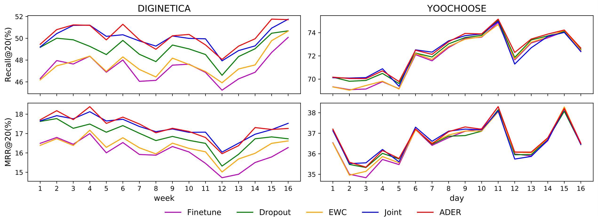

# ADER: Adaptively Distilled Exemplar Replay towards Continual Learning for Session-based Recommendation
Author: Fei MI, Xiaoyu LIN 
We propose a method called Adaptively Distilled Exemplar Replay (ADER) by periodically replaying
previous training samples (i.e., exemplars) to the current model with an adaptive distillation loss.
## Table of Contents

- [Background](#background)
- [Requirements](#requirements)
- [Dataset and Pre-processing](#dataset-and-pre-processing)
- [Model Training](#model-training)
- [Results](#results)
- [License](#license)

## Background
Although session-based recommenders have achieved significant improvements due to some new techniques like recurrent neural network and attention, they train the model only using entire data or most recent fraction. The growing concern about privacy prohibits recommenders keeping long-term user’s browsing history. On the other hand, more recent data is more useful for recommenders, but how to select the last fraction of data from the entire dataset is a problem in this static scenario. We address those problems by employing existing recommender in an incremental learning scenario and propose a framework called Adaptively Distilled Exemplar Replay (ADER) to balance the model’s ability to learn new data and catastrophic forgetting. It is based on a loss composed of a cross-entropy loss to learn the latest data and fine-tuned distillation loss to keep the knowledge gained from the previous data. We select and update a small exemplar set every period, and use it for distillation in the next period. We evaluate our framework on two benchmark datasets based on the self-attentive recommender. Our experimental results show that ADER outperforms state-of-the-art baselines. Furthermore, we also find ADER overcomes the model trained by the entire dataset, which demonstrates its advantages in removing long-term user data.

## Requirements
Python 3.7, TensorFlow 2.1.0, and other common packages listed in `requirements.txt` or `requirements.yaml`. 
Install required environment: `conda create env -f requirement.yaml` 
Activate required environment: `conda activate ader`

## Dataset and Pre-processing
Two widely used dataset are adopted:
### Dataset
- [DIGINETICA](http://cikm2016.cs.iupui.edu/cikm-cup): This dataset contains click-streams data on a e-commerce
site over a 5 months, and it is used for CIKM Cup 2016.
- [YOOCHOOSE](http://2015.recsyschallenge.com/challenge.html) :It is another dataset used by RecSys Challenge 2015  for predicting
click-streams on another e-commerce site over 6 months.
### Pre-process
The pre-processed data used in our paper is uploaded in `data/DIGINETICA` and `data/YOOCHOOSE` folder. 
**Note:** The name of each sub-dataset is from 1 to 17, however, we name them from 0 to 16 in our paper. 
**Note:** Although the sub-dataset of YOOCHOOSE is named as week, it is actually splited by day.
### Run data pre-process
Download `train-item-views.csv` or `yoochoose-clicks.dat` into folder `data\dataset`. 
For DIGINETICA: run `python DataPreprocessing.py` 
For YOOCHOOSE: run `python DataPreprocessing.py --dataset=yoochoose-clicks.dat --test_fraction=day` 

## Model Training
The implemention of self-attentive recommender is modified based on [SASRec](https://github.com/kang205/SASRec). 
To train our model on DIGINETICA: `python main.py` 
To train our model on YOOCHOOSE: `python main.py --dataset=YOOCHOOSE --lambda_=1.0`

## Results
ADER significantly outperforms other methods. More importantly, it even outperforms Joint. This result empirically
reveals that ADER is a promising solution for the continual recommendation setting by effectively preserving user
preference patterns learned before.

## License

