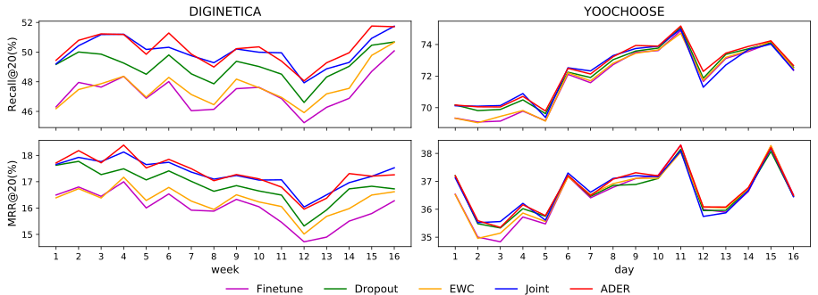

# *ADER:* Adaptively Distilled Exemplar Replay towards Continual Learning for Session-based Recommendation
**EPFL | [Artificial Intelligence Laboratory (LIA)](https://lia.epfl.ch/) | Semester Project (Spring 2020)**  
**[RecSys 2020](https://recsys.acm.org/recsys20/) | Best Short Paper**


## About
- This is our implementation for the paper:  
[ADER: Adaptively Distilled Exemplar Replay towards Continual Learning for Session-based 
Recommendation](https://dl.acm.org/doi/abs/10.1145/3383313.3412218)  
    - **Authors**: Fei Mi, Xiaoyu Lin, and Boi Faltings  
    - *First two authors have similar contributions.*  
    - Please cite our paper if you use the code or datasets.  
- This is also a semester project completed by Xiaoyu Lin and supervised by Fei Mi and Prof. Boi Faltings.  
- [[Poster](poster.pdf)] - [[Video](https://crossminds.ai/video/5f7fc27ad81cf36f1a8e37b6)]
## Table of Contents  
- [Background](#background)
- [Requirements](#requirements)
- [Dataset and Pre-processing](#dataset-and-pre-processing)
- [Model Training and Testing](#model-training-and-testing)
- [Baseline Methods and Ablation Study](#baseline-methods-and-ablation-study)
- [Results](#results)
- [Citation](#citation)

## Background
>*Although session-based recommenders have achieved significant improvements due to some new techniques like recurrent 
neural network and attention, they train the model only using entire data or most recent fraction. The growing concern 
about privacy prohibits recommenders keeping long-term user’s browsing history. On the other hand, more recent data is
more useful for recommenders, but how to select the last fraction of data from the entire dataset is a problem in this 
static scenario.  
>We address those problems by employing existing recommender in an incremental learning scenario and 
propose a framework called Adaptively Distilled Exemplar Replay (ADER) to balance the model’s ability to learn new data 
and catastrophic forgetting. It is based on a loss composed of a cross-entropy loss to learn the latest data and 
fine-tuned distillation loss to keep the knowledge gained from the previous data. We select and update a small exemplar 
set every period, and use it for distillation in the next period.  
>We evaluate our framework on two benchmark datasets based on the self-attentive recommender. Our experimental results 
show that ADER outperforms state-of-the-art baselines. Furthermore, we also find ADER overcomes the model trained by 
the entire dataset to some extent, which demonstrates its advantages in removing long-term user data.*
## Requirements
- Python 3.7
- TensorFlow 2.1.0
- Other common packages listed in `requirements.txt` or `requirements.yaml`  
- Install required environment: `conda create env -f requirement.yaml`  
- Activate required environment: `conda activate ader`

## Dataset and Pre-processing
### Dataset
Two widely used dataset are adopted:  

- [DIGINETICA](http://cikm2016.cs.iupui.edu/cikm-cup): This dataset contains click-streams data on a e-commerce
site over 5 months, and it is used for CIKM Cup 2016.  
- [YOOCHOOSE](http://2015.recsyschallenge.com/challenge.html): It is another dataset used by RecSys Challenge 2015 
for predicting click-streams on another e-commerce site over 6 months.  

The pre-processed data used in our paper is uploaded in `data/DIGINETICA` and `data/YOOCHOOSE` folder.<br/>
### Run data pre-process
- Download `train-item-views.csv` or `yoochoose-clicks.dat` into folder `data\dataset`.<br/>
- For DIGINETICA, run from the `data` folder of the project:
```
python preprocessing.py
```
- For YOOCHOOSE, run from the `data` folder of the project:
```
python preprocessing.py --dataset=yoochoose-clicks.dat --test_fraction=day
```

## Model Training and Testing
The implemention of self-attentive recommender is modified based on [SASRec](https://github.com/kang205/SASRec).<br/>
- To train our model on DIGINETICA, run from the root of the project:
```
python main.py
```
- To train our model on YOOCHOOSE, run from the root of the project:
```
python main.py --dataset=YOOCHOOSE --lambda_=1.0 --batch_size=512 --test_batch=64
```

## Baseline Methods and Ablation Study
- We provide four baseline methods for comprehensive analysis. To test baseline methods, please run from 
the root of the project:
    - *Finetune :* ``python main.py --finetune=True --save_dir=finetune``
    - *Dropout :* ``python main.py --dropout=True --save_dir=dropout``
    - *EWC :* ``python main.py --ewc=True --save_dir=ewc``
    - *Joint :* ``python main.py --joint=True --save_dir=joint``
- We also provide some in-depth analysis and ablation study models for users to run and test:
    - *Different number of exemplars (e.g. 20k) :* ``python main.py --exemplar_size=20000 --save_dir=exemplar20k``
    - *ER<sub>hering</sub> :* ``python main.py --disable_distillation=True --save_dir=ER-herding``
    - *ER<sub>loss</sub> :* ``python main.py --disable_distillation=True --selection=loss --save_dir=ER-loss``
    - *ER<sub>random</sub> :* ``python main.py --disable_distillation=True --selection=random --save_dir=ER-random``
    - *ADER<sub>equal</sub> :* ``python main.py --equal_exemplar=True --save_dir=equal_exemplar``
    - *ADER<sub>fix</sub> :* ``python main.py --fix_lambda=True --save_dir=fix_lambda``
- **Notes:** 
    - The dropout rate can be set by changing the argument `--dropout_rate`, 
and the hyper-parameter *lambda* in EWC can be set by changing the argument `--lambda_`. You may fine tune these 
hyper-parameters to get the best performance on different dataset. 
    - For more details of ablation study models, please refer to our paper.


## Results
ADER significantly outperforms other methods. This result empirically reveals that ADER is a promising solution for the continual recommendation setting by effectively preserving user
preference patterns learned before.
<p align="center">
  
</p>

## Citation

```bibtex
@inproceedings{mi2020ader,
  title={Ader: Adaptively distilled exemplar replay towards continual learning for session-based recommendation},
  author={Mi, Fei and Lin, Xiaoyu and Faltings, Boi},
  booktitle={ACM Conference on Recommender Systems},
  pages={408--413},
  year={2020}
}
```
